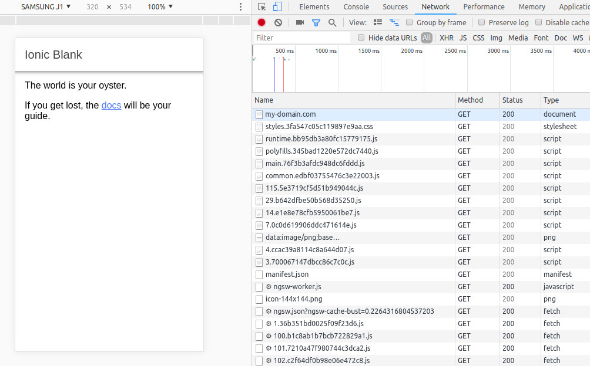
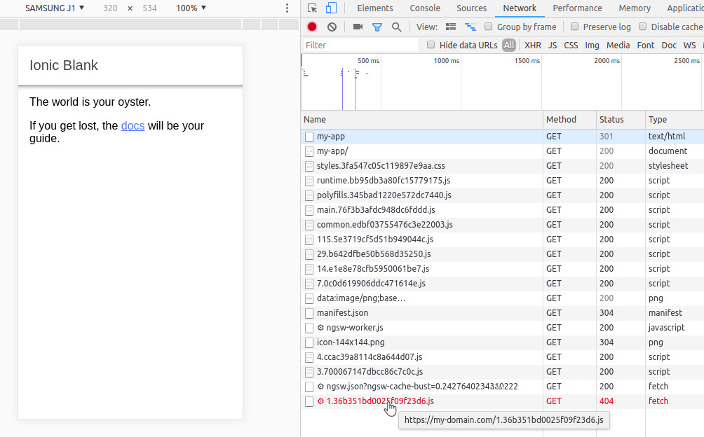

# ionic-4-PWA
Skeleton of a PWA application made with Ionic-4

Software version
- Ionic CLI 4.10.2
- Angular CLI: 7.3.6
- Node v10.13.0 (npm v6.4.1)  
- OS: linux x64
- Angular: 7.2.10


I created this project with the following commands:
```bash
ionic start ionic-4-pwa blank
cd ./ionic-4-pwa
ng add @angular/pwa
ionic build --prod
```

After that I moved the content of the generated **www** folder, to the folder /var/www/http/my-domain/ where I have setted my apache with certificates for the https protocol. Then I access https://my-domain.com and everything works perfect as a PWA !!

### https://my-domain.com



# What is the problem ?

I need to serve my application in a subfolder instead of the root as it is now.
Something like: https://my-domain.com/my-app/

## changes to make:
- change base href in the index.html:
    ```html
    <base href="/my-app/"/>
    ```
- change start_url in manifest.json:
    ```json
    "start_url": "/my-app/",
    ```
- create a subfolder called 'my-app' in the server folder and copy all the content of the generated www
    ```bash
    mkdir /var/www/http/my-domain/my-app
    cp ./www/* /var/www/http/my-domain/my-app/ -R
    ```

### https://my-domain.com/my-app/



As you can see on the image the first compressed js was not found because the applications tries to fetch it from the root instead from the subfolder /my-app

If you take a look at the generated **ngsw.json** you can see the list of all compressed js generated by ionic. But they are listed with a root absolute path like this:
```json
{
  "configVersion": 1,
  "timestamp": 1553614482418,
  "index": "/index.html",
  "assetGroups": [
    {
      "name": "app",
      "installMode": "prefetch",
      "updateMode": "prefetch",
      "urls": [
        "/1.36b351bd0025f09f23d6.js",
        "/100.b1c8ab1b7bcb722829a1.js",
        "/101.7210a47f980744c3dca2.js",
        "/102.c2f64df0b98e06e472c8.js",
        "/103.e772c3123d5abbab5bcc.js",
        "/104.210508d1abbe6584ce9f.js",
        "/105.2de8b215f62585f32a1a.js",
        "/106.44ff43688f324d103fb1.js",
        "/107.978badac0bd0290e13eb.js",
        "/108.462ea6dc538e5e9a2020.js",
        "/109.6e35607054f90da1b7ff.js",
        "/110.6a2546407771f06277fc.js",
        "/111.79eebf930b4b260a5a29.js",
        "/112.2b3f670581ddfd1573ba.js",
        "/113.32c7a4b7e5a2c998714b.js",
        "/114.10359bdaafe9f4f8ed40.js",
        "/115.5e3719cf5d51b949044c.js",
        "/116.ca8cd5d75a8d0dfe06f9.js",
        "/117.faeb2ef6a6a3c1d638fc.js",
        "/118.aa59a38020ab8fcac988.js",
        "/119.55f6cc2f88eb18d3eccb.js",
        "/120.f6280360b20742fc1517.js",
        "/121.774d81135a9e51360891.js",
        "/122.8c3e839cd3b12912a09c.js",
        "/123.749ce9a30ac9000e7258.js",
        ...
```

